# Speech Enhancement based on DNN (TF-Masking, Spectral-Mapping), DNN-NMF, NMF  

### NMF based SE
- Non-negative matrix factorization (NMF) can be applied to separate a target source from mixture data. The basis matrix for all sources is built by concatenating the basis matrices for individual sources so that the product of the corresponding parts of the basis and encoding matrices becomes separated target sources. 

### DNN-NMF based SE
- In DNN-NMF model [1], a deep neural network (DNN) is used to estimate the encoding vectors to improve the performance of a target data extraction algorithm with source subspace overlap.

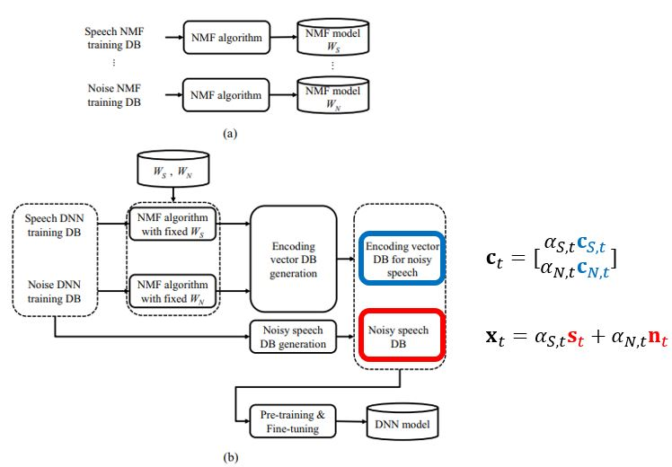

### DNN based SE
- There are mainly two groups of speech enhancement using DNN, i.e., masking-based models (TF-Masking) [2] and mapping-based models (Spectral-Mapping) [3]. TF-Masking models describe the time-freqeuncy relationships of clean speech to background interference, while Spectral-Mapping models correspond to the spectral representations of clean speech [2].

| | |
| :---: | :---: |
|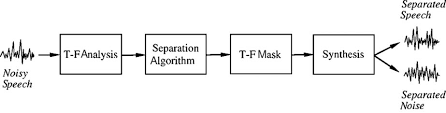 | 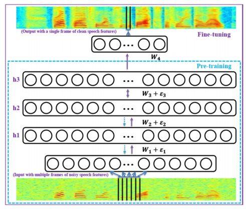 |

### Statistical model based SE
- https://github.com/eesungkim/Speech_Enhancement_MMSE-STSA

## Results

|-| Time domain | Frequency domain |
|:---:|:---: | :---: |
|Clean|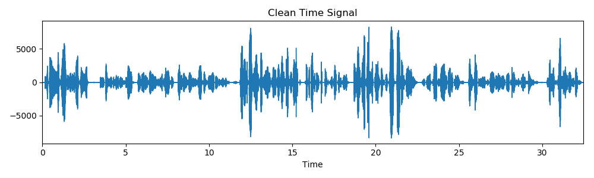 | 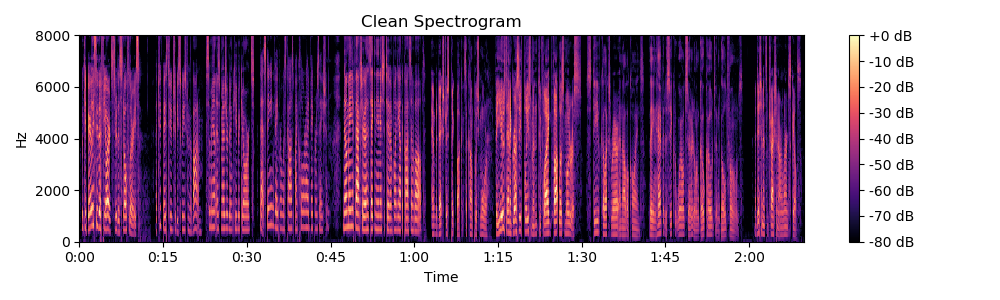 |
|Noisy|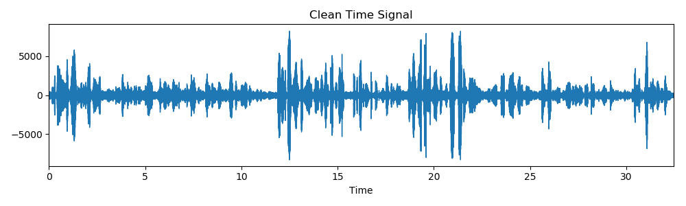 | 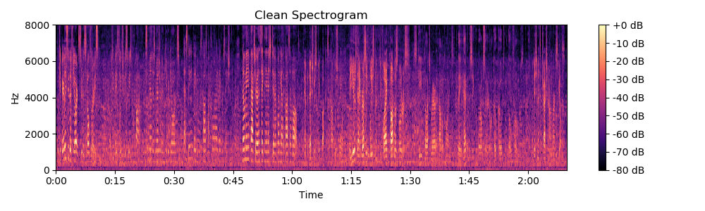 |
|NMF|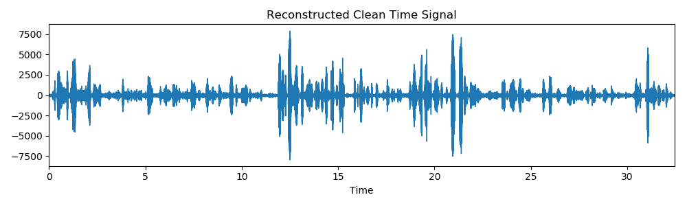 |  |
|NMF-DNN|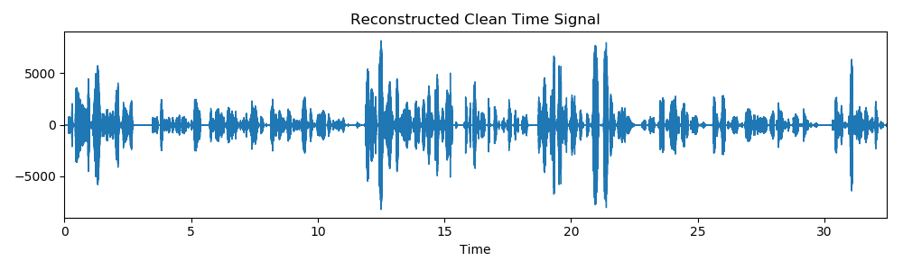 | 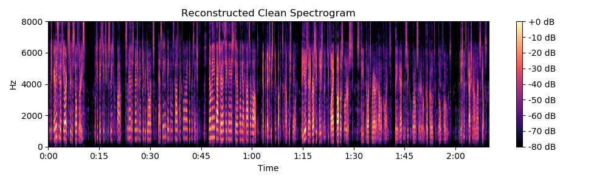 |
|DNN (TF-Masking)| | 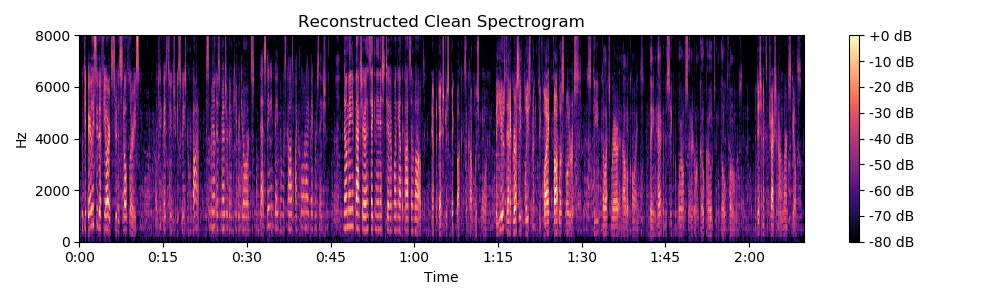 |
|DNN (Spectral-Mapping)| |  |

## Implementations

### Settings
* Sampling Rate : 16kHz
* 512-point Hamming window with 75% overlap.

### Dataset
Clean speech data was taken from the TIMIT database. We selected 62 utterances for training set and 10 utterances for test set.
PESQ performance will be further enhanced with a full TIMIT dataset. The factory, babble, machinegun noises from NOISEX-92 database were used for training and test.

Ten utterances from 5 male and 5 female speakers were used for performance evaluation. All models were trained over 3 types (factroy, babble, machinegun) of noises pooled together to examine whether the proposed algorithm can learn various types of source characteristics simultaneously.

## References
* [1] [T. G. Kang, K. Kwon, J. W. Shin, and N. S. Kim, “NMF-based target source separation using deep neural network,” IEEE Signal Processing Letters, vol. 22, no. 2, pp. 229-233, Feb. 2015.](https://mspl.gist.ac.kr/wp-content/uploads/2017/01/NMF-based-speech-enhancement-incorporating-deep-neural-network.pdf)
* [2] [Wang, DeLiang, and Jitong Chen. "Supervised speech separation based on deep learning: An overview." IEEE/ACM Transactions on Audio, Speech, and Language Processing (2018).](https://ieeexplore.ieee.org/abstract/document/8369155/)
* [3] [Xu, Yong, et al. "A regression approach to speech enhancement based on deep neural networks." IEEE/ACM Transactions on Audio, Speech and Language Processing, Jan. 2015.](https://dl.acm.org/citation.cfm?id=2736113)
